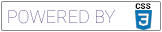
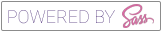

# SCSS DLMS

[](https://www.w3schools.com/css/) [](https://sass-lang.com/)

SCSS DLM is a SASS based Theme Mode Switcher. You can use it to make your apps easily switch between Dark and Light Modes. It supports text-shadow, background-color, color, box shadow, fill. Pretty much everything that is color based. It supports two more features out of the box:

-   `set-color` feature for setting colors.
-   `set-url` feature, for switching CSS Image based variables according to the modes.
-   `set-content` feature, for switching text based content according to the modes. (mostly for `::before` and `::after` pseudo elements, but it can be used in animations, transitions, filters etc.)

## How it works

You simply use a function , `set-color`, that accepts arguments in a form of a map (`light: $colorKey, dark: $colorKey`).

When you call the `set-color` function, the system assigns a random ID (using the SASS built in feature `unique-id()`) and searches for the color key in the palettes, generates the colors (if you used some color modifier) and references it to `light` and `dark` maps.

If the color key isn't found, it throws an error, lists available color keys.

By switching the HTML attribute `theme`, from `light` to `dark`, you switch to the desired theme mode.

There are also some minor tree shaking capabilities. It doesn't render all colors available in palettes, just the ones that are used.

## Usage

### `set-color`

#### Examples:

```scss
color: set-color(
    (
        light: pink-100,
        dark: pink-900,
    )
);
```

```scss
background-color: set-color(
    (
        light: green-100,
        dark: green-900,
    )
);
```

### `set-content`

#### Examples:

```scss
filter: set-content(
    (
        light: grayscale(50%),
        dark: hue-rotate(90deg),
    )
);
```

```scss
$color: set-color((light: blue-100, dark: blue-500);
filter: set-content((light: grayscale(50%) drop-shadow(16px 16px 20px $color), dark: hue-rotate(90deg)));
```

### `set-url`

#### Examples:

```scss
$color: set-color((light: blue-100, dark: blue-500);
background-image: set-url((light: '../assets/doggo_play.jpg', dark: '../assets/doggo_sleep.jpg'));
```

## Available colors

I've used the official color palettes from [MaterialUI](https://material-ui.com/customization/color/#color-palette).

You are also able to add your custom colors by adding them to the `_theme.scss` file (located in the `/scss/palettes/` folder).

> Please note, that you need to use unique names, not already used in other color palletes.

If you want to add/remove certain color palettes, just open the `_variables.scss` file and add/remove them from the `$colorsMapList` variable.

## Installation

If you are using it in a custom project. Just copy over the `scss` folder and place it where ever you want. Include the SCSS `app.scss` file. If you don't want the demo content, just remove `components` folder and its inclusion from `_variables.scss` on line 13.

## Running the example (already built in the project)

In order to run it, you will need:

-   [Node.js](https://nodejs.org/) v14+
-   [Yarn](https://yarnpkg.com/) v2+

Install the dependencies and devDependencies.

```sh
yarn install
```

Run the project in --watch mode:

```sh
yarn watch
```

Build the project in --watch mode:

```sh
yarn build
```

## License

MIT

**Free Software, Hell Yeah!**
